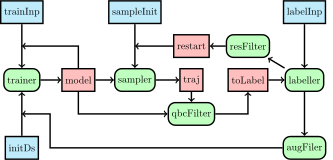

#  `tips/explore`

`tips/explore` is a workflow in which a model is used to sample the
configuration space.

{: style="min-width:80%" .center}

The flowchart of the workflow is shown above, with the blue boxes being the
inputs, green boxes being the sub-workflows, and the red being intermediate
dataflow channels, the final model will be the output for each set of inputs.

## Options

| Inputs       | Default  | Description                      |
|--------------|----------|----------------------------------|
| trainer      | "pinn"   | an abstract trainer              |
| sampler      | "pinn"   | an abstract sampler              |
| labeller     | "lammps" | an abstract labeller             |
| maxIter      | 10       | max iteration                    |
| initDs       | null     | initial dataset                  |
| trainInit    | null     | initial input for trainer        |
| trainParam   | null     | extra params for trainer         |
| trainSeeds   | 3        | number of seeds for qbc          |
| trainSteps   | 200000   | initial training steps           |
| retrainIter  | 200000   | retrain steps after augmentation |
| sampleInit   | null     | initial structure for sampler    |
| sampleParams | null     | extra params for sampler         |
| labelInp     | null     | input for labbeller              |


## Usage

`tips/explore` assumes that we have already a minimal dataset to start with,
this might not be always the case. Below show an example of training a model
with the SPC/Fw classical force field, where an initial dataset is generated by
the same force field with a short NVT simulation (the files to reproduce this
workflow can be found
[here](https://github.com/yqshao/tips/tree/master/examples/explore-nacl))

```groovy
#!/usr/bin/env nextflow
nextflow.enable.dsl=2

// hard coded
initInp = 'csvr.lmp'
initGeo = 'init.xyz'
trainInp = 'pinet.yml'
labelInp = 'label.lmp'

// params, will be parsed to all sub-workflows
params.publishDir = 'explore'
params.augFilter  = '-vmax "e:-20" -amax "f:10"'
params.resFilter  = '-vmax "e:-42" -amax "f:4"'
params.lmpEmap    = '1:1,2:8,3:11,4:17'
params.lmpInit    = 'nacl.init'
params.lmpData    = 'nacl.data'
params.lmpSetting = 'nacl.setting'

tipsDir = '../../nextflow'
include {sampler} from "$tipsDir/adaptor" addParams(sampler:'lammps')
include {explore} from "$tipsDir/explore" addParams(trainInp:trainInp,
                                                    labelInp:labelInp)

workflow {
    initDs = sampler([null, [inp:initInp, init:initGeo, subDir:'init']])
    inputs = initDs.map{[it[0], [initDs:it[1]]]}
    explore(inputs)
}
```

Here, the training and labelling configs are parsed to the explorer through
`params`.
